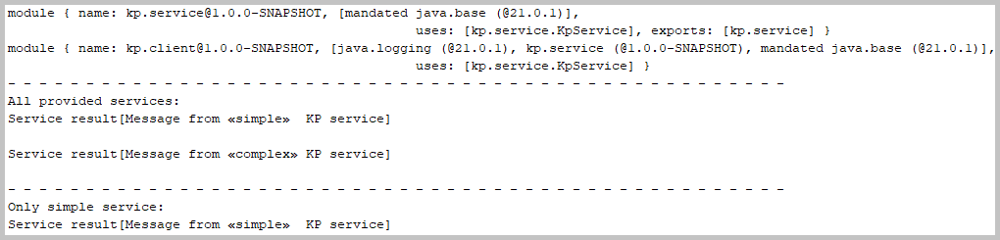

<!DOCTYPE html>
<HTML lang="en">
<META charset="UTF-8">
<BODY>

<H2 id="contents">Study20 README Contents</H2>
<H3 id="top">Research <a href="https://openjdk.org/projects/jigsaw/">Java Platform Module System</a> (JPMS)</H3>

 

<I>The diagram of the JPMS modules</I>

<table style="border:solid">
<caption>Java module declarations</caption>
<thead><tr>
<th style="border:solid">Maven Module Name</th>
<th style="border:solid">JPMS Module Name</th>
<th style="border:solid">Module Descriptor Link</th>
</tr></thead>
<tbody><tr>
<td style="border:solid">service</td>
<td style="border:solid">kp.service</td>
<td style="border:solid">
<a href="https://github.com/k1729p/Study20/tree/master/service/src/main/java/module-info.java">'module-info.java'</a></td>
</tr><tr>
<td style="border:solid">service-provider</td>
<td style="border:solid">kp.provider</td>
<td style="border:solid">
<a href="https://github.com/k1729p/Study20/tree/master/service-provider/src/main/java/module-info.java">'module-info.java'</a></td>
</tr><tr>
<td style="border:solid">service-client</td>
<td style="border:solid">kp.client</td>
<td style="border:solid">
<a href="https://github.com/k1729p/Study20/tree/master/service-client/src/main/java/module-info.java">'module-info.java'</a></td>
</tr></tbody></table>

Java source code. Packages: 
 
 module 'service': 
<a href="https://github.com/k1729p/Study20/tree/master/service/src/main/java/kp/service/">kp.service</a> 
 module 'service-provider': 
<a href="https://github.com/k1729p/Study20/tree/master/service-provider/src/main/java/kp/provider/">kp.provider</a> 
 module 'service-client': 
<a href="https://github.com/k1729p/Study20/tree/master/service-client/src/main/java/kp/client/">kp.client</a> 

 
 module 'service': 
<a href="http://htmlpreview.github.io/?https://github.com/k1729p/Study20/blob/main/service/docs/apidocs/overview-tree.html">
Java API Documentation</a> 
 module 'service-provider': 
<a href="http://htmlpreview.github.io/?https://github.com/k1729p/Study20/blob/main/service-provider/docs/apidocs/overview-tree.html">
Java API Documentation</a> 
 module 'service-client': 
<a href="http://htmlpreview.github.io/?https://github.com/k1729p/Study20/blob/main/service-client/docs/apidocs/overview-tree.html">
Java API Documentation</a> 

Action: 
 
 1. Build and run the 
<a href="https://github.com/k1729p/Study20/blob/main/service-client/src/main/java/kp/client/KpServiceClient.java">
'KpServiceClient'</a> with the batch file 
<a href="https://github.com/k1729p/Study20/blob/main/0_batch/01%20MVN%20clean%20install%20%2B%20Run%20Application.bat">
'01 MVN clean install + Run Application.bat'</a>. 

1. Alternative action: build and run the 
<a href="https://github.com/k1729p/Study20/blob/main/service-client/src/main/java/kp/client/KpServiceClient.java">
'KpServiceClient'</a> with the batch file 
<a href="https://github.com/k1729p/Study20/blob/main/0_batch/02%20Create%20Image%20And%20Run.bat">
'02 Create Image And Run.bat'</a>. 
This process uses the local Maven repository. 
It creates the run-time image with the Java linker <B>jlink</B> and uses the generated runtime for execution.

2. The service registering and loading.

 

<I>The diagram of the service registering and loading</I>

The two providers of the 
<a href="https://github.com/k1729p/Study20/blob/main/service/src/main/java/kp/service/KpService.java">
'kp.service.KpService'</a> implementation:

<ul>
<li><a href="https://github.com/k1729p/Study20/blob/main/service-provider/src/main/java/kp/provider/KpServiceProviderSimple.java">
'kp.provider.KpServiceProviderSimple'</a>, 
the providing method: <a href="https://github.com/k1729p/Study20/blob/main/service-provider/src/main/java/kp/provider/KpServiceProviderSimple.java#L22">
'kp.provider.KpServiceProviderSimple::provider'</a>
</li>
<li><a href="https://github.com/k1729p/Study20/blob/main/service-provider/src/main/java/kp/provider/KpServiceProviderComplex.java">
'kp.provider.KpServiceProviderComplex'</a>, 
the providing method: <a href="https://github.com/k1729p/Study20/blob/main/service-provider/src/main/java/kp/provider/KpServiceProviderComplex.java#L22">
'kp.provider.KpServiceProviderComplex::provider'</a>
</li>
</ul>

3. The main client method: 
<a href="https://github.com/k1729p/Study20/blob/main/service-client/src/main/java/kp/client/KpServiceClient.java#L29">
'kp.client.KpServiceClient::main'</a>. 
With the method 'java.util.ServiceLoader::load' the service providers are located and loaded. 
The service method: 
<a href="https://github.com/k1729p/Study20/blob/main/service/src/main/java/kp/service/KpService.java#L23">
'kp.service.KpService::launch'</a>.

 

<I>The sequence diagram</I>

 

<I>The screenshot of the console log.</I>

<a href="#top">Back to the top of the page</a>

</BODY>
</HTML>