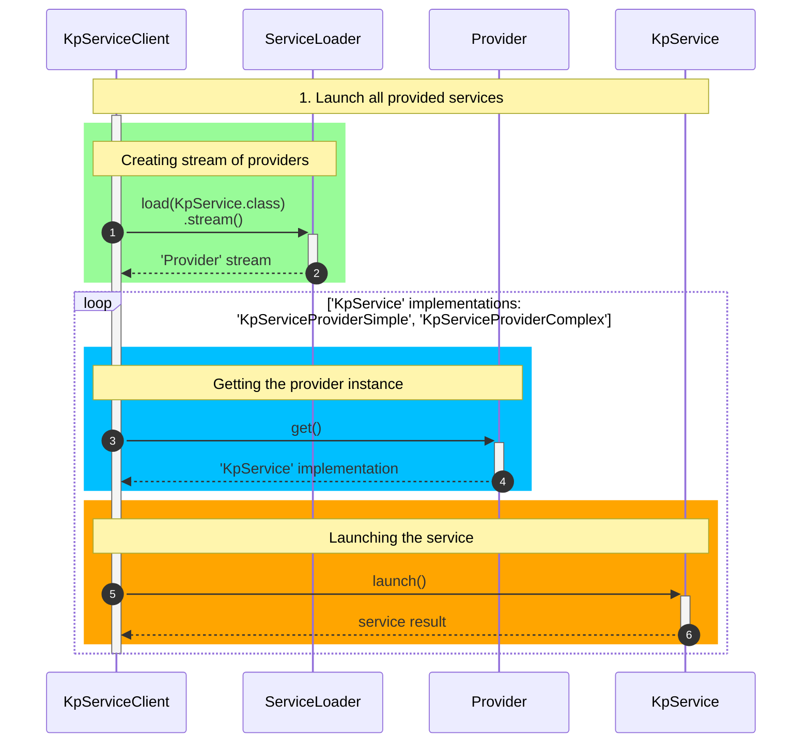
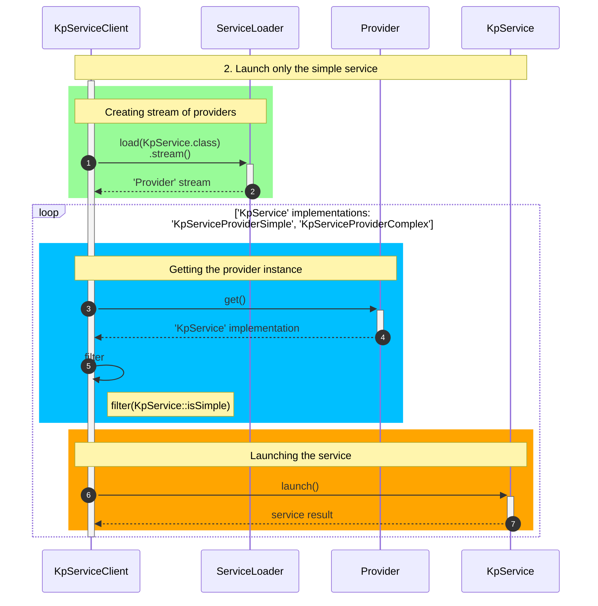

```mermaid
sequenceDiagram
participant SC as KpServiceClient
participant SL as ServiceLoader
participant PR as Provider
participant SV as KpService

autonumber
note over SC,SV : 1. Launch all provided services
activate SC
rect rgb(152,251,152)
 note over SC,SL : Creating stream of providers
 SC  ->>+ SL : load(KpService.class)<br>.stream()
 SL -->>- SC : 'Provider' stream
end
loop 'KpService' implementations:<br>'KpServiceProviderSimple', 'KpServiceProviderComplex'
 rect rgb(0,191,255)
  note over SC,PR : Getting the provider instance
  SC  ->>+ PR : get()
  PR -->>- SC : 'KpService' implementation
 end
 rect rgb(255,165,0)
  note over SC,SV : Launching the service
  SC  ->>+ SV : launch()
  SV -->>- SC : service result
 end
end
deactivate SC
```

```mermaid
sequenceDiagram
participant SC as KpServiceClient
participant SL as ServiceLoader
participant PR as Provider
participant SV as KpService

autonumber
note over SC,SV : 2. Launch only the simple service
activate SC
rect rgb(152,251,152)
 note over SC,SL : Creating stream of providers
 SC  ->>+ SL : load(KpService.class)<br>.stream()
 SL -->>- SC : 'Provider' stream
end
loop 'KpService' implementations:<br>'KpServiceProviderSimple', 'KpServiceProviderComplex'
 rect rgb(0,191,255)
  note over SC,PR : Getting the provider instance
  SC  ->>+ PR : get()
  PR -->>- SC : 'KpService' implementation
  SC  ->> SC : filter
  note right of SC : filter(KpService::isSimple)
 end
 rect rgb(255,165,0)
  note over SC,SV : Launching the service
  SC  ->>+ SV : launch()
  SV -->>- SC : service result
 end
end
deactivate SC
```